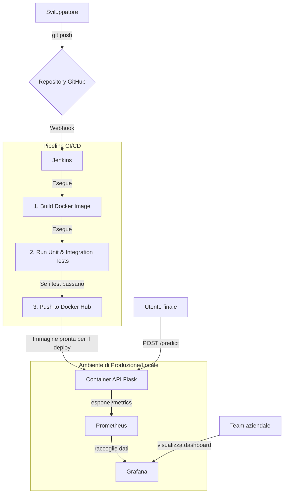

# Deploy e monitoraggio di un modello di sentiment analysis

Questo progetto implementa un sistema MLOps completo per l'automazione del deploy e del monitoraggio di un modello di machine learning. L'obiettivo è analizzare il sentiment (positivo, negativo, neutro) delle recensioni di prodotti per una piattaforma e-commerce, fornendo un'infrastruttura scalabile e affidabile.

L'architettura si basa su un approccio containerizzato e segue le pratiche di continuous integration e continuous deployment (CI/CD).


## Architettura del sistema

Il sistema è orchestrato tramite Docker e Docker Compose. Ogni componente gira in un container isolato, garantendo coerenza tra gli ambienti di sviluppo e produzione.



## Funzionalità principali

-   **API REST**: un'applicazione Flask (Python) che espone il modello di sentiment analysis.
    -   `POST /predict`: accetta una recensione e restituisce il sentimento analizzato.
    -   `GET /metrics`: espone metriche custom in formato Prometheus.
-   **Pipeline CI/CD**: un `Jenkinsfile` definisce l'automazione per:
    1.  Costruire l'immagine Docker dell'applicazione.
    2.  Eseguire test unitari e di integrazione in un ambiente isolato.
    3.  Pubblicare l'immagine validata su Docker Hub.
-   **Monitoraggio**:
    -   **Prometheus** raccoglie metriche chiave come tempi di risposta, numero di richieste e distribuzione dei sentiment.
    -   **Grafana** fornisce una dashboard interattiva per visualizzare le metriche in tempo reale.

## Stack tecnologico

-   **Backend**: Python, Flask
-   **Machine learning**: Scikit-learn
-   **Containerizzazione**: Docker, Docker Compose
-   **CI/CD**: Jenkins
-   **Monitoraggio**: Prometheus, Grafana
-   **Controllo di versione**: Git, GitHub

## Istruzioni per l'avvio in locale

Per eseguire il progetto sul tuo computer, assicurati di avere [Git](https://git-scm.com/) e [Docker Desktop](https://www.docker.com/products/docker-desktop/) installati e in esecuzione.

### 1a. Scarica il modello di Machine Learning

Prima di avviare i servizi, è necessario scaricare il modello pre-addestrato e posizionarlo nella cartella `app/`.

Puoi scaricarlo dal seguente link e rinominarlo in `sentimentanalysismodel.pkl`:
[Link per il download del modello](https://github.com/Profession-AI/progetti-devops/raw/main/Deploy%20e%20monitoraggio%20di%20un%20modello%20di%20sentiment%20analysis%20per%20recensioni/sentimentanalysismodel.pkl)

Assicurati che il file `sentimentanalysismodel.pkl` si trovi in `sentiment-analysis-mlops/app/`.

### 1. Clona il repository

```bash
git clone https://github.com/deacs11/sentiment-analysis-mlops.git
cd sentiment-analysis-mlops
```

### 2. Avvia l'ambiente di monitoraggio (API, Prometheus, Grafana)

Questo comando utilizza il file `docker-compose.yml` per avviare l'applicazione e gli strumenti di monitoraggio.

```bash
docker-compose up -d
```

I servizi saranno disponibili ai seguenti indirizzi:
-   **API di sentiment analysis**: `http://localhost:5000`
-   **Prometheus**: `http://localhost:9090`
-   **Grafana**: `http://localhost:3000` (login di default: `admin` / `admin`)

### 3. Avvia l'ambiente Jenkins (Opzionale)

Per eseguire il server Jenkins, usa il file di configurazione dedicato.

```bash
docker-compose -f docker-compose.jenkins.yml up -d
```
Jenkins sarà disponibile all'indirizzo `http://localhost:8080`.

## Esempio di utilizzo dell'API

Puoi testare l'endpoint di predizione con uno strumento come `curl` dal tuo terminale.

**Richiesta con sentimento positivo:**
```bash
curl -X POST -H "Content-Type: application/json" -d '{"review": "This is a truly amazing product, I love it!"}' http://localhost:5000/predict
```

**Risposta attesa:**
```json
{
  "sentiment": "positive",
  "confidence": 0.95
}
```

**Richiesta con sentimento negativo:**
```bash
curl -X POST -H "Content-Type: application/json" -d '{"review": "This is a terrible experience, very bad."}' http://localhost:5000/predict
```

**Risposta attesa:**
```json
{
  "sentiment": "negative",
  "confidence": 0.92
}
```